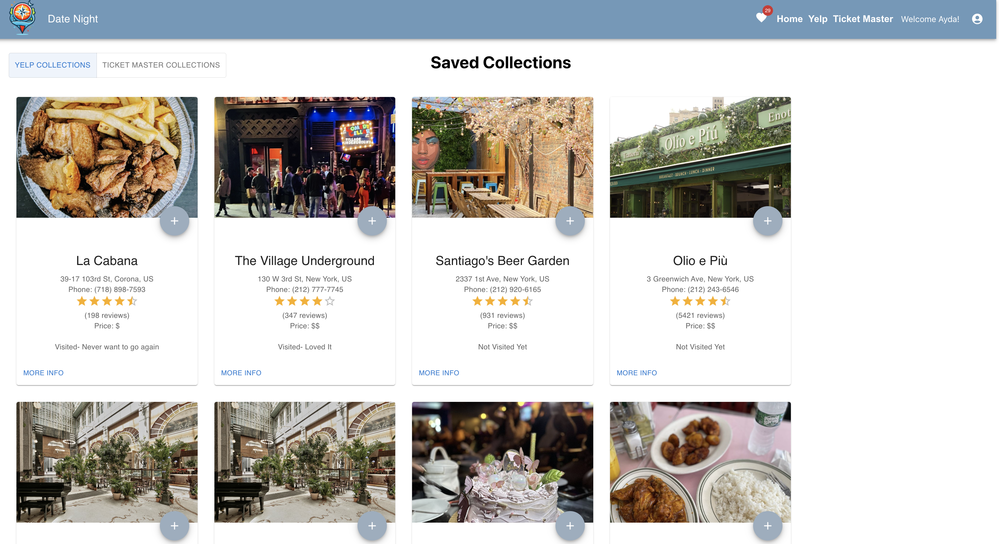

# Date Night App

The Date Night app is tailored to be a comprehensive platform for individuals, families, and groups seeking entertaining activities close to home. Ideal for organizing a family gathering, a lively evening with friends, or a romantic date, this app streamlines the discovery of local events and activities. Users can browse through a variety of activity categories, ensuring there's always something intriguing to do no matter the occasion.

The app's user-friendly interface supports effortless navigation and planning, making it an essential companion for all your social outings. Date Night allows users to save their favorite finds into a user specific collection for future reference. Each saved item can be managed within the app. Users have the option to delete activities or update their statuses with notes on their experiences, such as marking them as visited. This feature not only helps in organizing future plans but also in tracking past adventures.

Date Night is a blend of convenience, personalization, and a wide array of options, the Date Night app promises to enrich your social life by connecting you with the best your locality has to offer.

# Screenshots

# Technologies Used

- React
- JavaScript
- HTML
- CSS
- MongoDB
- Express
- Node.js
- Trello
- Heroku
- Git
- Github
- Visual Studios Code
- Yelp API
- Ticket Master API
- API Authentication

# Getting Started

[Click to visit the Date Night App!](https://date-night-app-57a5365aa17a.herokuapp.com/)

# Next Steps

- I would like to improve the app by providing personalized suggestions based on user preferences and location
- I'd liek to add a sort feature, by status, date, rating, and/or distance
- Another further enhacement is 